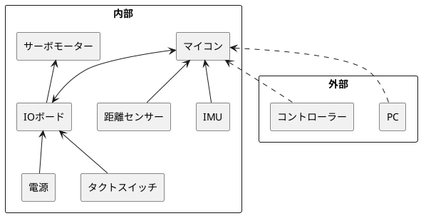

#### コンセプト

ROBO-ONEに参加可能なロボットとする。

[60日でできる！ 二足歩行ロボット自作入門](https://bookwalker.jp/dede62c9bf-3f1d-4a42-94d3-e3f815012317/)を参考に構成しました。

##### ROBO-ONEについて

* 競技カテゴリは以下の三つです。
  * ROBO-ONE
    * ヘビー級（3kg以下）のロボットが対象
  * ROBO-ONE Light
    * 市販されている認定ロボットでの参加が可能
    * 重量1kg以下であれば自作のロボットも参加が可能
  * ROBO-ONE auto
    * 試合中、選手はコントローラーに触れることはできない完全自律機体による格闘競技です。
* 各賞は以下の通りです。
  * ROBO-ONEパフォーマンス
    * アイデア賞
  * ROBO-ONEファイト
    * 技術賞

禁止事項は以下の通りです。

* しゃがみ歩行、しゃがみ攻撃
  * 膝関節が90度以上あること
  * 股に該当する観戦が90度以上あること
* 横攻撃禁止
  * 左右の各45度以内において、相手に対して横から攻撃すること

制約は以下の通りです。

* ROBO-ONE/ROBO-ONE Lightでは、無線操縦並びに自立操縦が認められています。
* ROBO-ONE autoは、ロボットに搭載されたセンサーやコンピューターに搭載されたプログラムにより、完全自律操縦が認められています。

##### システム概要

1. 制御部
  * マイコン
2. 入力部
  * センサー
  * カメラ
3. 駆動部
  * アクチュエーター
  * サーボモーター
4. 無線通信部
  * コントローラー
  * データー受信部
5. 電源
6. ハンガー
  * ロボットの保管場所
7. 外部制御PC
  * 開発用
  * 遠隔操作補助（ROBO-ONEでの仕様は禁止）

##### 仕様

* 基本性能
  * 二足歩行を１秒間に２歩程度可能
  * 転倒状態からの復帰が可能
  * 周囲の障害物の把握と回避が可能
  * 自己位置推定が可能
  * 自分の姿勢常態の把握
* 寸法
  * 高さ：350mm 以内
  * 幅：未定
  * 奥行：未定
  * 重量：3kg 以内
* 自由度
  * 脚部：足首、膝、股
  * 腕部：肩、肘、手首
  * 腰：２
  * 首：３
* センサー
  * 距離センサー
  * IMU

 {width="50%"}
    <copyright>60日でできる！ 二足歩行ロボット自作入門</copyright>
    [link](https://bookwalker.jp/dede62c9bf-3f1d-4a42-94d3-e3f815012317/)

##### 設計

* 電気系

* 通信方式

通信プロトコル
	フレーム
